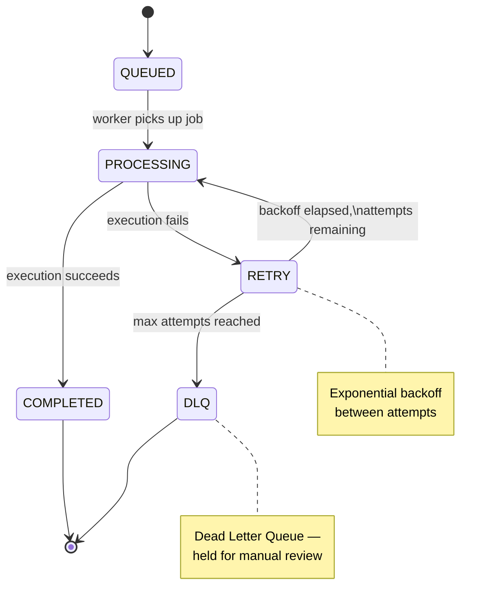

<div align="center">

# ⚡ Aetheris

### Distributed Job Scheduler for Reliable Background Work

*"Run work without losing control."*

[](https://nodejs.org/)
[](https://expressjs.com/)
[](https://docs.bullmq.io/)
[](https://redis.io/)
[](https://www.postgresql.org/)
[](https://react.dev/)
[](https://socket.io/)
[](https://www.docker.com/)

</div>

---

## What is Aetheris?

Aetheris is a backend-focused **distributed job scheduler**. Applications submit work to it instead of running that work inline — Aetheris queues the job, schedules it, retries it if it fails, and reports back what happened.

It's not a UI product with a scheduler bolted on. It's a **control plane for background work**: a small API surface for submitting jobs, a queue layer for coordinating execution, a fleet of workers that actually run the code, and a dashboard that watches all of it happen in real time.

```
Client / Application
        │
        ▼
Node.js + Express API
        │
        ▼
      BullMQ
        │
        ▼
      Redis
        │
        ▼
 Worker Processes
        │
        ▼
  Job Execution
        │
        ▼
   PostgreSQL
```

## Why Aetheris?

Most applications eventually hit the same wall: something needs to run in the background — sending emails, generating reports, processing uploads, syncing external APIs — and doing it inline blocks the request and has no story for failure.

The usual next step is "throw it on a queue library," which handles execution but rarely answers the operational questions that come after:

| Question | Aetheris' Answer |
|---|---|
| What happens when a job fails halfway through? | Automatic retries with exponential backoff, then a Dead Letter Queue |
| How do I know what actually happened to a job? | Full attempt history persisted in PostgreSQL, not just in-memory state |
| Can two network retries create the same job twice? | Idempotency keys enforced at the database layer |
| How do multiple teams/apps share one scheduler safely? | Project-scoped API keys — each project only sees its own jobs |
| Can I *see* the system working, not just query it? | A live React dashboard fed by Redis Pub/Sub over Socket.IO |
| Do I need to poll for job status? | No — status changes push to the dashboard the moment they happen |

Aetheris isn't trying to reinvent job queues from scratch — it's built on the well-tested primitives (BullMQ, Redis) and focuses its own engineering on the parts those primitives don't solve: persistence, multi-tenancy, idempotency, and observability.

## Architecture

Aetheris is deliberately layered. Each layer has exactly one job, which keeps failure modes local instead of cascading.


**Why the separation matters:** the API never executes a job directly. It only ever writes an instruction ("run this") into the queue. This means a slow or crashing job can never take the API down with it — workers can be scaled, restarted, or killed independently of everything else.

## Job Lifecycle

Every job moves through a well-defined state machine. Nothing disappears silently — a job either completes, or it eventually lands in the Dead Letter Queue where it can be inspected and retried manually.



## Features

Aetheris currently supports:

**Scheduling**
- Immediate, delayed, and recurring jobs
- Job priorities
- Queue pause / resume
- Job cancellation

**Reliability**
- Automatic retries with exponential backoff
- Dead Letter Queue for exhausted jobs
- Manual retry of failed jobs
- Full job attempt history

**Execution**
- Multiple worker processes
- Configurable worker concurrency
- PostgreSQL-backed job persistence and status tracking

**Multi-tenancy & Access**
- JWT authentication for dashboard/API users
- User registration and login
- Project-based organization
- Project-specific API keys for external job submission
- Idempotent job creation via `(project_id, idempotency_key)`

**Observability**
- Redis Pub/Sub event stream
- Real-time updates over Socket.IO
- React monitoring dashboard with live job statistics

**Infrastructure**
- Dockerized Redis
- Dockerized PostgreSQL

## How It Works

1. A client authenticates and submits a job — either through the authenticated dashboard API or the external API using a project API key.
2. The API validates the request, checks idempotency, and enqueues the job into BullMQ, then persists a record in PostgreSQL.
3. An available worker picks the job up from Redis and executes it.
4. On success, the job is marked complete. On failure, it's requeued with a backoff delay and retried, up to a configured attempt limit.
5. Jobs that exhaust their retries move to the Dead Letter Queue instead of vanishing.
6. Every state transition is published over Redis Pub/Sub, relayed through Socket.IO, and rendered live on the dashboard — no polling required.

## Core Engineering Concepts

### 1. Distributed Workers

The API's only responsibility is accepting and validating work — it never runs a job's actual logic. Execution is handed off entirely to independent worker processes:

```
Client → API → Queue → Redis → Worker
```

Because workers just consume from Redis, you can run one worker or twenty without changing a line of API code. Aetheris' current worker uses BullMQ's built-in concurrency to process multiple jobs per process.

### 2. Redis vs. BullMQ — Different Jobs, Same Layer

It's easy to conflate these two, but they solve different problems:

| | Redis | BullMQ |
|---|---|---|
| Role | In-memory data store | Job queue abstraction *on top of* Redis |
| Provides | Queue state storage, coordination, Pub/Sub | Scheduling, delayed/recurring jobs, priorities |
| Also handles | — | Retries, backoff, worker processing model |

Redis is the infrastructure; BullMQ is the logic that gives that infrastructure meaning as a job queue.

### 3. PostgreSQL — The System of Record

Redis is fast but transient by design — it's optimized for queue coordination, not long-term history. PostgreSQL is where Aetheris keeps the durable, queryable record of everything that happened:

| Table | Purpose |
|---|---|
| `users` | Dashboard/API account records |
| `projects` | Tenant boundary — jobs belong to a project |
| `jobs` | Job metadata, current status, payload |
| `job_attempts` | One row per execution attempt, for full history |
| `recurring_schedules` | Definitions for repeating jobs |

The split is deliberate: **Redis answers "what needs to happen right now,"** while **PostgreSQL answers "what has happened, ever."** Losing Redis state after a restart is recoverable; losing PostgreSQL history is not — so they're held to different durability standards on purpose.

### 4. Retry + Exponential Backoff

Failures are expected, not exceptional. Aetheris retries a failing job up to **3 attempts**, waiting progressively longer between each:

```
Attempt 1
   │
   ▼ failure
  wait (short)
   │
   ▼
Attempt 2
   │
   ▼ failure
  wait (longer)
   │
   ▼
Attempt 3
   │
   ▼
success ──► COMPLETED
   │
   ▼ failure
Dead Letter Queue
```

Exponential backoff exists to avoid hammering a downstream dependency that's already struggling — a transient database blip or a rate-limited third-party API is far more likely to succeed on a delayed retry than an immediate one.

### 5. Dead Letter Queue (DLQ)

A job that fails through all of its retry attempts doesn't just disappear — it's moved into a separate Dead Letter Queue. This keeps permanently-broken jobs from clogging the active queue while preserving them for inspection: an operator can look at *why* a job failed and choose to retry it manually once the underlying issue is fixed, rather than losing that work entirely.

### 6. Idempotency

External job submissions require two headers:

```
X-API-Key: <project-api-key>
Idempotency-Key: <unique-request-key>
```

Aetheris enforces a unique database constraint on **`(project_id, idempotency_key)`**. If the same idempotency key is submitted twice for the same project, Aetheris returns the *existing* job instead of creating a duplicate.

This matters because networks are unreliable — a client might time out waiting for a response and retry a request that actually succeeded server-side. Without idempotency, that retry creates a duplicate job (and duplicate side effects, like a second email or a second charge). With it, retries are safe by default.

### 7. Redis Pub/Sub vs. BullMQ — Not the Same Thing

These two use the same Redis instance but answer completely different questions:

| | Question it answers |
|---|---|
| **BullMQ / Redis (queue)** | "What work needs to be done?" |
| **Redis Pub/Sub** | "What just happened?" |

The queue is about coordinating *future* execution. Pub/Sub is a fire-and-forget broadcast of *past* events, used purely for observability:

```
Worker → Redis Pub/Sub → Socket.IO → React Dashboard
```

When a worker finishes (or fails) a job, it publishes an event. Socket.IO relays that event to connected dashboard clients instantly — the dashboard never has to ask "did anything change?"; it's told the moment something does.

### 8. Authentication

Aetheris separates two distinct trust boundaries:

- **JWT authentication** — used by human users logging into the dashboard/API to manage their own projects and jobs.
- **Project-specific API keys** — used by external applications submitting jobs programmatically, scoped to a single project.

Users can only ever see and act on projects and jobs they own — there's no cross-tenant visibility.

## Tech Stack

**Backend**
Node.js · Express.js · JavaScript · BullMQ · Redis · Redis Pub/Sub · PostgreSQL · JWT · bcrypt · Socket.IO

**Frontend**
React · Vite · Socket.IO Client · Custom CSS

**Infrastructure**
Docker · Redis (Docker) · PostgreSQL (Docker)

**Development**
Git · GitHub · Postman · VS Code

## Project Structure

```
aetheris/
│
├── dashboard/                # React monitoring dashboard
│   ├── src/
│   │   ├── components/       # Reusable UI building blocks
│   │   ├── context/          # App-wide React context (auth, sockets)
│   │   ├── hooks/            # Custom hooks (job data, live updates)
│   │   ├── pages/            # Route-level views
│   │   ├── services/         # API + Socket.IO client wrappers
│   │   ├── styles/           # Custom CSS
│   │   └── utils/            # Shared frontend helpers
│   ├── package.json
│   └── vite.config.js
│
├── server/                   # Express API
│   ├── config/                # DB, Redis, and app configuration
│   ├── controllers/           # Request handling / business logic
│   ├── database/              # Schema + query layer
│   ├── middleware/            # Auth, validation, error handling
│   ├── queues/                # BullMQ queue definitions
│   ├── routes/                # Express route definitions
│   └── server.js
│
├── worker/                   # Job execution process
│   └── worker.js
│
├── .env.example
├── .gitignore
├── package.json
└── package-lock.json
```

## Getting Started

### Clone the repository

```bash
git clone https://github.com/Ayushl22/Aetheris.git
cd Aetheris
```

### Install dependencies

```bash
# Backend
npm install

# Frontend
cd dashboard
npm install
cd ..
```

### Environment Variables

Copy `.env.example` to `.env` and fill in the values:

```env
REDIS_HOST=localhost
REDIS_PORT=6379

POSTGRES_HOST=localhost
POSTGRES_PORT=5433
POSTGRES_USER=aetheris
POSTGRES_PASSWORD=your_password
POSTGRES_DB=aetheris

JWT_SECRET=your_jwt_secret
```

> ⚠️ **Never commit your `.env` file.** It contains secrets used to sign tokens and connect to your database — keep it local and out of version control.

### Infrastructure (Docker)

```bash
# Redis
docker run -d --name aetheris-redis -p 6379:6379 redis

# PostgreSQL
docker run -d --name aetheris-postgres \
  -e POSTGRES_USER=aetheris \
  -e POSTGRES_PASSWORD=aetheris \
  -e POSTGRES_DB=aetheris \
  -p 5433:5432 postgres
```

Then load the schema:

```bash
# server/database/schema.sql
```

### Run the system

Aetheris runs as three separate processes:

```bash
# Terminal 1 — API
cd server
node server.js

# Terminal 2 — Worker
cd worker
node worker.js

# Terminal 3 — Dashboard
cd dashboard
npm run dev
```

| Service | URL |
|---|---|
| API | http://localhost:3000 |
| Dashboard | http://localhost:5173 |

## API Overview

**Authentication**
```
POST /auth/register
POST /auth/login
```

**Projects**
```
GET    /projects
GET    /projects/:id
POST   /projects
DELETE /projects/:id
```

**Jobs**
```
POST   /jobs
GET    /jobs
GET    /jobs/:id
DELETE /jobs/:id

POST   /jobs/delayed
POST   /jobs/recurring

GET    /jobs/failed
POST   /jobs/failed/:id/retry

POST   /jobs/pause
POST   /jobs/resume
```

**External API** (for job submission from other applications)
```
POST /api/v1/jobs
```

Required headers:
```
X-API-Key: <project-api-key>
Idempotency-Key: <unique-request-key>
```

### Example Request

```bash
curl -X POST http://localhost:3000/api/v1/jobs \
  -H "Content-Type: application/json" \
  -H "X-API-Key: proj_live_9f2a1c7e8b3d4f56" \
  -H "Idempotency-Key: send-welcome-email-user-1042" \
  -d '{
    "type": "send-email",
    "payload": {
      "to": "user@example.com",
      "template": "welcome"
    },
    "priority": 5
  }'
```

## Dashboard

The React dashboard is Aetheris' window into the running system — no log-tailing required.

- Real-time job status, pushed instantly via Socket.IO
- Job statistics at a glance
- Per-job details and full attempt history
- One-click retry for failed jobs
- Job cancellation
- Recurring job management
- Project management
- Queue pause / resume controls


## Reliability

Aetheris treats failure as a first-class case rather than an edge case:

- Failed jobs are retried automatically with exponential backoff before being given up on
- Jobs that exhaust retries are preserved in a Dead Letter Queue instead of being lost
- Every attempt — successful or not — is recorded in PostgreSQL for later inspection
- Idempotency keys prevent duplicate execution caused by network retries
- API and worker processes are decoupled, so a failing job can't take the API down

## Current Status

**Completed**

- [x] Job queue
- [x] Worker processes
- [x] Worker concurrency
- [x] Job priorities
- [x] Delayed jobs
- [x] Recurring jobs
- [x] Retries
- [x] Exponential backoff
- [x] Dead Letter Queue
- [x] PostgreSQL persistence
- [x] Job attempt history
- [x] JWT authentication
- [x] Project management
- [x] Project-specific API keys
- [x] Idempotent job creation
- [x] Redis Pub/Sub
- [x] Socket.IO real-time updates
- [x] React dashboard
- [x] Queue pause/resume
- [x] Job cancellation
- [x] Failed job retry
- [x] Dockerized Redis
- [x] Dockerized PostgreSQL

**Future Add-Ons**

- [ ] Production-grade retry lifecycle
- [ ] Graceful worker shutdown
- [ ] Job timeouts
- [ ] Rate limiting
- [ ] Scheduler management UI
- [ ] Metrics / observability
- [ ] Health checks
- [ ] Full Docker Compose setup
- [ ] Production deployment

## Engineering Takeaways

Building Aetheris meant working through the problems that only show up once a queue is expected to run *reliably*, not just run:

- Separating "what needs to happen" (Redis/BullMQ) from "what has happened" (PostgreSQL) instead of trying to make one store do both jobs.
- Treating retries and the Dead Letter Queue as core functionality, not an afterthought bolted onto a happy-path queue.
- Making idempotency a database constraint rather than a convention — enforced, not just documented.
- Keeping the API and worker processes fully decoupled so scaling or restarting one never risks the other.
- Using Pub/Sub purely for observability, deliberately kept separate from the queue's execution logic, so a dashboard refresh can never affect job processing.

## Author

**Ayush Lambat**

Backend Engineering · Distributed Systems · Job Queues · Redis · BullMQ · PostgreSQL · Real-Time Systems

[GitHub](https://github.com/Ayushl22) · [LinkedIn](https://www.linkedin.com/in/ayush-lambat-926240324)

---

<div align="center">

*Aetheris — run work without losing control.*

</div>
