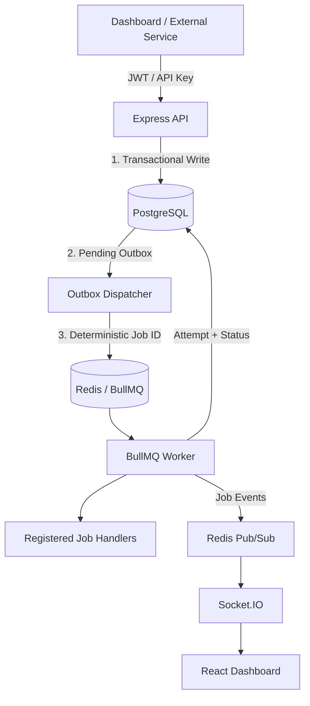
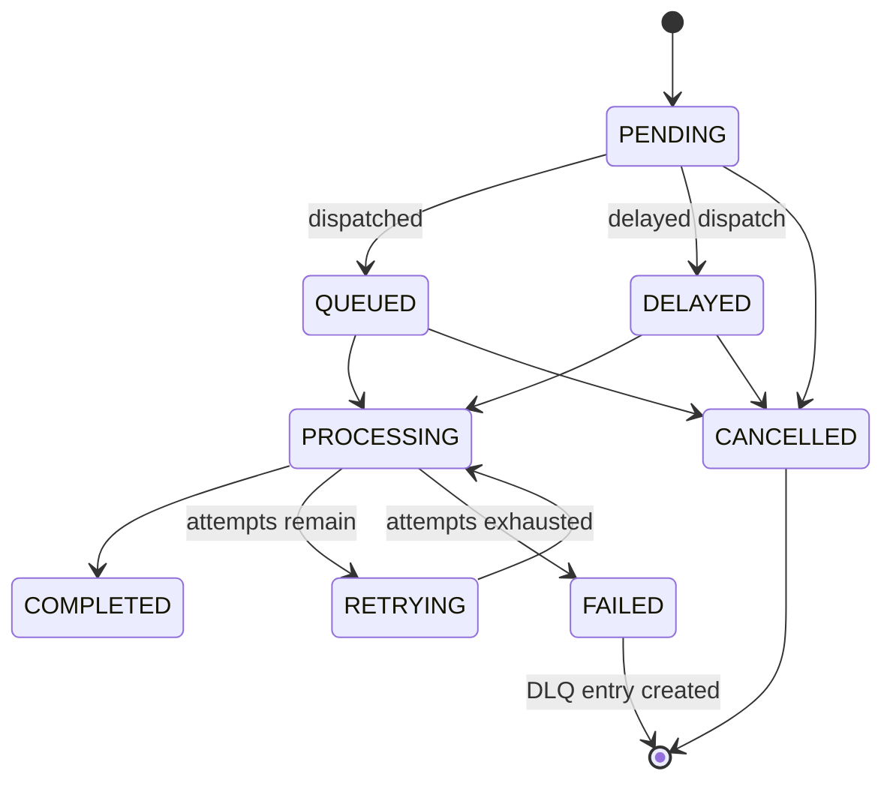

<div align="center">
# Aetheris

**Reliable background job infrastructure for modern applications.**

Aetheris is a production-oriented, multi-tenant background job scheduling and execution platform built with **Node.js, PostgreSQL, Redis, and BullMQ**.

Applications submit jobs to Aetheris instead of executing them inline. Aetheris **persists jobs durably in PostgreSQL, dispatches them through a transactional outbox, executes them using BullMQ workers, tracks every attempt, handles retries and failures, and streams real-time status to a React dashboard.**

[](https://nodejs.org/)
[](https://expressjs.com/)
[](https://www.postgresql.org/)
[](https://redis.io/)
[](https://docs.bullmq.io/)
[](https://react.dev/)
[](https://www.docker.com/)
[](https://docs.github.com/actions)
[](#license)

> **Core architecture:** PostgreSQL is the durable source of truth; Redis/BullMQ is the derived execution layer.

## Overview

Background jobs are essential for tasks such as sending notifications, processing uploads, generating reports, and synchronizing external services. Running these operations directly inside an HTTP request couples application latency to task execution and makes retries, failures, and recovery harder to manage.

Aetheris separates **durability from execution**.

When a job is submitted:

1. **PostgreSQL persists the job first** inside a database transaction.
2. A **transactional outbox** records the pending delivery to the execution layer.
3. The **outbox dispatcher** publishes the job to Redis/BullMQ using a deterministic job ID.
4. A **BullMQ worker** executes the registered handler.
5. Every execution attempt and its outcome are persisted back to PostgreSQL.
6. Failed jobs are retried with backoff and eventually moved to the **Dead Letter Queue (DLQ)** when attempts are exhausted.
7. Job state changes are pushed to the dashboard through **Socket.IO**, with REST polling as a fallback.

This architecture means Redis can be temporarily unavailable without losing accepted jobs. A Redis failure delays execution rather than losing the job because **PostgreSQL remains the system of record**.

Aetheris is also multi-tenant by design:

```text
User
 └── Project
      ├── Jobs
      ├── Recurring Schedules
      └── Dead Letter Queue
```

Every operation is scoped through this ownership hierarchy, while external job submissions use project-scoped API keys and database-enforced idempotency keys.

## Why Aetheris?

Traditional background-job systems often stop at queueing: accept a job, push it to Redis, and let a worker execute it.

That approach works until something fails between those steps.

Aetheris is designed around the operational problems that appear in production:

| Problem | Aetheris' Approach |
|---|---|
| Redis is unavailable when a job is submitted | PostgreSQL persists the job first; delivery is retried later |
| A request is retried by the client | Database-enforced idempotency keys prevent duplicate job creation |
| A worker fails while processing a job | Automatic retries with exponential backoff |
| A job exhausts its retries | The job is preserved in a persistent Dead Letter Queue |
| Multiple applications share the platform | Project-level isolation and API keys enforce tenant boundaries |
| Operators need to understand failures | PostgreSQL stores complete execution and attempt history |
| The dashboard needs live updates | Socket.IO pushes job state changes in real time |
| Redis state needs to be rebuilt | PostgreSQL remains the durable system of record |

Aetheris does not attempt to replace BullMQ or Redis. Instead, it builds a **durable application layer around them**.

> **PostgreSQL owns what happened. Redis/BullMQ coordinates what should execute next.**

## Key Features

### Reliability
- **PostgreSQL-first persistence** — jobs are durably stored before entering the execution layer.
- **Transactional outbox** — separates job acceptance from queue delivery.
- **Deterministic BullMQ job IDs** — make repeated dispatch attempts idempotent.
- **Database-enforced idempotency** — prevents duplicate job creation.
- **Redis outage recovery** — failed queue delivery remains pending in PostgreSQL.
- **Graceful shutdown and readiness checks**.

### Job Processing
- Immediate, delayed, and recurring jobs
- `HIGH`, `MEDIUM`, and `LOW` priorities
- Automatic retries with exponential backoff
- Persistent per-attempt execution history
- Job cancellation before processing begins
- Persistent Dead Letter Queue (DLQ)
- Manual retry of failed DLQ jobs

### Multi-Tenancy & Security
- JWT authentication
- Project-scoped API keys
- One-time API key reveal
- Tenant isolation through `User → Project → Job`
- Database-enforced idempotency keys
- Request validation and pagination limits
- Authentication rate limiting
- Security headers and CORS validation
- SSRF protections for HTTP and webhook jobs

### Real-Time Dashboard
- React + Vite dashboard
- Socket.IO live updates
- REST polling fallback
- Job detail and execution history
- Recurring schedule management
- DLQ management and retry
- Project and API-key management

### Infrastructure
- Dockerized API, worker, dashboard, PostgreSQL, and Redis
- Single `docker-compose.yml`
- GitHub Actions CI
- Database migrations
- Unit and integration tests
- Redis outage resilience testing

## Architecture

Aetheris separates **durable application state** from **ephemeral execution state**.



### Components

- **Dashboard** — React/Vite application for authentication, project management, jobs, schedules, and DLQ operations.
- **API** — Express 5 service responsible for authentication, authorization, validation, projects, jobs, schedules, and health checks.
- **PostgreSQL** — durable system of record for users, projects, jobs, attempts, schedules, DLQ entries, and outbox records.
- **Outbox Dispatcher** — publishes pending PostgreSQL outbox records to Redis/BullMQ and retries failed deliveries.
- **Redis / BullMQ** — execution coordination layer for queueing, delay, priority, retries, and worker coordination.
- **Worker** — executes registered handlers and persists execution outcomes.
- **Socket.IO** — authenticated real-time event delivery to the dashboard.

## Multi-Tenancy & Security

Aetheris is designed as a multi-tenant system where every resource belongs to a specific project owned by a specific user.

```text
User
 └── Project
      ├── Jobs
      ├── Recurring Schedules
      └── Dead Letter Queue
```

Every operation is scoped through this ownership hierarchy, preventing one tenant from accessing another tenant's resources.

### Authentication & Authorization

- JWT authentication for dashboard and API access
- HS256 with issuer and audience validation
- bcrypt password hashing
- Project-scoped API keys
- API keys stored as peppered hashes
- API keys revealed only once during creation
- Authorization through the `User → Project → Resource` ownership chain

### API Security

- Explicit request validation
- Pagination bounds
- Registered job-type enforcement
- Authentication rate limiting
- Explicit CORS allowlist
- Socket.IO origin validation
- Security headers
- Production configuration validation

### Idempotency

External job submissions require an `Idempotency-Key`.

```text
Client Request
      │
      │ Idempotency-Key
      ▼
┌───────────────┐
│  PostgreSQL   │
│   uniqueness  │
│   constraint  │
└───────┬───────┘
        │
        ├── New key ──────► Create job
        │
        └── Existing key ─► Prevent duplicate
```

### SSRF Protection

HTTP and webhook jobs include protections against common SSRF attacks:

- Private IP blocking
- Loopback blocking
- Link-local blocking
- Hostname resolution
- URL credential rejection
- Redirect refusal
- Request timeouts
- Production hostname allowlisting

> **Note:** DNS resolution is performed at request time. A dedicated outbound proxy would provide stronger protection against DNS rebinding.

## Job Processing

| Job Type | Description |
|---|---|
| Immediate | Executes as soon as the job reaches the queue |
| Delayed | Executes after a specified delay |
| Recurring | Automatically creates executions according to a schedule |

### Job Lifecycle



## Reliability & Failure Handling

Aetheris provides **at-least-once execution with durable state and persisted attempt history**.

### Transactional Outbox

```text
HTTP Request
     │
     ▼
PostgreSQL Transaction
     │
     ├── Job Record
     └── Outbox Record
             │
             ▼
      Outbox Dispatcher
             │
             ▼
        Redis / BullMQ
             │
             ▼
           Worker
```

If Redis is unavailable, the job remains safely persisted and delivery is retried.

### Deterministic Job IDs

Repeated dispatch attempts use the same deterministic BullMQ job ID, preventing intentional duplicate queue entries.

### Retry Strategy

```text
Attempt 1
   │
   ├── Success ─────────────► COMPLETED
   └── Failure
         │
         ▼
      Backoff
         │
         ▼
Attempt 2
   │
   ├── Success ─────────────► COMPLETED
   └── Failure
         │
         ▼
       ...
         │
         ▼
Attempts exhausted
         │
         ▼
       FAILED
         │
         ▼
        DLQ
```

### Dead Letter Queue

When a job exhausts its retry attempts, Aetheris creates a persistent DLQ entry.

Operators can:

- Inspect failed jobs
- Review attempt history
- Understand failures
- Retry failed jobs manually

## Job Handlers

Aetheris uses an explicit **handler registry**. A job cannot execute arbitrary code; its `type` must match a registered handler.

| Handler | Purpose |
|---|---|
| `notification.log` | Records a notification event |
| `http.request` | Performs an allowlisted HTTP/HTTPS request |
| `webhook` | Delivers an event payload to a webhook endpoint |
| `demo.success` | Deterministic successful execution |
| `demo.flaky` | Deterministic retry/failure demonstration |
| `demo.fail` | Deterministic failure demonstration |

Example:

```json
{
  "type": "notification.log",
  "data": {
    "message": "Deploy completed",
    "channel": "ops"
  }
}
```

## Real-Time Dashboard

The React + Vite dashboard provides:

- User authentication
- Project management
- One-time API key creation/reveal
- Job submission
- Job status monitoring
- Full execution attempt history
- DLQ management
- Manual DLQ retry
- Recurring schedule management
- Real-time job status updates

### Real-Time Architecture

```text
Worker
  │
  │ Job Event
  ▼
Redis Pub/Sub
  │
  ▼
Socket.IO
  │
  ▼
React Dashboard
```

Socket.IO improves visibility while REST polling provides a fallback.

## API

### Authentication

| Method | Endpoint | Description |
|---|---|---|
| `POST` | `/auth/register` | Create a user account |
| `POST` | `/auth/login` | Authenticate and receive a JWT |

### Projects

| Method | Endpoint | Description |
|---|---|---|
| `POST` | `/projects` | Create a project and receive its API key |
| `GET` | `/projects` | List the user's projects |
| `GET` | `/projects/:id` | Get project details |
| `DELETE` | `/projects/:id` | Delete a project when no active jobs remain |

### Jobs

| Method | Endpoint | Description |
|---|---|---|
| `GET` | `/jobs/types` | List registered job types |
| `POST` | `/jobs` | Submit an immediate job |
| `POST` | `/jobs/delayed` | Submit a delayed job |
| `GET` | `/jobs` | List and filter jobs |
| `GET` | `/jobs/:id` | Get job details and attempt history |
| `DELETE` | `/jobs/:id` | Cancel a job |
| `GET` | `/jobs/failed` | List open DLQ entries |
| `POST` | `/jobs/failed/:dlqId/retry` | Retry a DLQ job |
| `POST` | `/jobs/pause` | Pause the global queue |
| `POST` | `/jobs/resume` | Resume the global queue |

### Recurring Jobs

| Method | Endpoint | Description |
|---|---|---|
| `GET` | `/jobs/recurring` | List recurring schedules |
| `POST` | `/jobs/recurring` | Create a recurring schedule |
| `PATCH` | `/jobs/recurring/:scheduleId` | Update a recurring schedule |
| `DELETE` | `/jobs/recurring/:scheduleId` | Delete a recurring schedule |

### External Job Submission

```http
POST /api/v1/jobs
X-API-Key: <project-api-key>
Idempotency-Key: <unique-request-key>
Content-Type: application/json
```

Example:

```json
{
  "type": "notification.log",
  "data": {
    "message": "Build completed",
    "channel": "ops"
  },
  "priority": "HIGH"
}
```

### Health & Readiness

| Method | Endpoint | Description |
|---|---|---|
| `GET` | `/health` | Liveness check |
| `GET` | `/ready` | PostgreSQL and Redis readiness check |

## Project Structure

```text
aetheris/
├── server/
│   ├── routes/
│   ├── controllers/
│   ├── services/
│   ├── middleware/
│   ├── config/
│   └── migrations/
├── worker/
│   ├── handlers/
│   └── worker.js
├── dashboard/
│   ├── src/
│   ├── Dockerfile
│   └── nginx.conf
├── test/
│   ├── unit/
│   ├── integration/
│   └── resilience/
├── scripts/
├── .github/
│   └── workflows/
│       └── ci.yml
├── Dockerfile
├── docker-compose.yml
├── .env.example
└── package.json
```

## Running Locally

### Prerequisites

- Node.js 24
- Docker
- Docker Compose

### Installation

```bash
npm install
npm install --prefix dashboard
```

### Environment

Create `.env` from `.env.example`.

```env
POSTGRES_PASSWORD=<secure-password>
JWT_SECRET=<32+ character-secret>
API_KEY_PEPPER=<32+ character-secret>
```

### Docker

```bash
docker compose up --build
```

Default endpoints:

```text
Dashboard → http://localhost:5173
API       → http://localhost:3000
```

### Local Development

```bash
npm run db:migrate
npm start
npm run worker
npm run dev --prefix dashboard
```

## Testing

```bash
npm run test:unit
npm test
npm run test:resilience
npm run check
```

Integration tests can be enabled with:

```bash
RUN_INTEGRATION_TESTS=1
```

## CI/CD

Aetheris uses GitHub Actions for continuous integration.

The pipeline:

1. Installs dependencies
2. Runs syntax and parse checks
3. Starts PostgreSQL and Redis
4. Applies migrations
5. Starts API and worker
6. Waits for readiness
7. Runs tests
8. Builds the dashboard

```text
Git Push / Pull Request
          │
          ▼
   GitHub Actions
          │
          ├── Install
          ├── Check
          ├── Migrate
          ├── Start Services
          ├── Test
          └── Build Dashboard
```

## Design Decisions

### PostgreSQL as the Source of Truth

```text
PostgreSQL
    │
    │ Durable State
    ▼
Jobs / Attempts / Schedules / DLQ / Outbox

Redis / BullMQ
    │
    │ Execution State
    ▼
Queue / Delay / Priority / Worker Coordination
```

### Transactional Outbox

```text
Without Outbox:

Database Write ✓
Redis Write    ✗
       │
       └── Job delivery can be lost


With Outbox:

Database Write ✓
Outbox Write   ✓
Redis Write    ✗
       │
       └── Dispatcher retries later
```

### Real-Time Updates Are Not a Correctness Dependency

If Socket.IO is unavailable, the underlying job state remains correct in PostgreSQL and can be retrieved through the REST API.

## Reliability Guarantees

Aetheris provides:

- Durable job acceptance through PostgreSQL
- Transactional outbox delivery
- Idempotent queue dispatch
- Database-level external idempotency
- At-least-once execution semantics
- Persistent attempt history
- Automatic retry and exponential backoff
- Persistent Dead Letter Queue
- Redis outage recovery
- Graceful worker shutdown
- Health and readiness checks
- Tenant-isolated job execution

### What Aetheris Does Not Claim

Aetheris does **not** claim exactly-once execution.

Distributed workers, retries, network failures, and process crashes can result in the same job being observed or executed more than once. Applications requiring stronger semantics should make their handlers idempotent.

## Known Limitations

- Authentication rate limiting is currently process-local rather than distributed.
- The outbox scanner does not currently use `SELECT ... FOR UPDATE SKIP LOCKED`; deterministic job IDs make concurrent dispatch safe, but multiple replicas may perform redundant dispatch work.
- HTTP SSRF protection performs DNS resolution at request time and does not completely eliminate DNS-rebinding races.
- HTTP egress could be moved behind a dedicated outbound proxy for stronger isolation.
- Real-time Socket.IO coverage can be expanded with additional end-to-end tests.
- Metrics and distributed tracing are not yet built into the platform.

## Future Improvements

- Redis-backed distributed authentication rate limiting
- `SKIP LOCKED` outbox processing
- Dedicated outbound HTTP proxy
- Prometheus-compatible metrics
- Distributed tracing
- Outbox lag monitoring
- DLQ volume monitoring
- Expanded Socket.IO end-to-end testing
- Production deployment configuration
- Horizontal worker scaling
- Per-project concurrency limits
- Improved operational dashboards

## Tech Stack

| Layer | Technology |
|---|---|
| Runtime | Node.js 24 |
| API | Express 5 |
| Database | PostgreSQL 17 |
| Queue | BullMQ |
| Cache / Broker | Redis 8 |
| Real-Time | Socket.IO |
| Frontend | React 19 + Vite |
| Authentication | JWT + bcrypt |
| Containers | Docker + Docker Compose |
| CI | GitHub Actions |
| Testing | Node.js Test Runner |

## Author

**Ayush Lambat**

[GitHub](https://github.com/Ayushl22) · [Project Repository](https://github.com/Ayushl22/NexusAI)

## License

Licensed under the **MIT License** — free to use, modify, and distribute per the license terms.

---

See [`package.json`](./package.json) for the license declaration.
