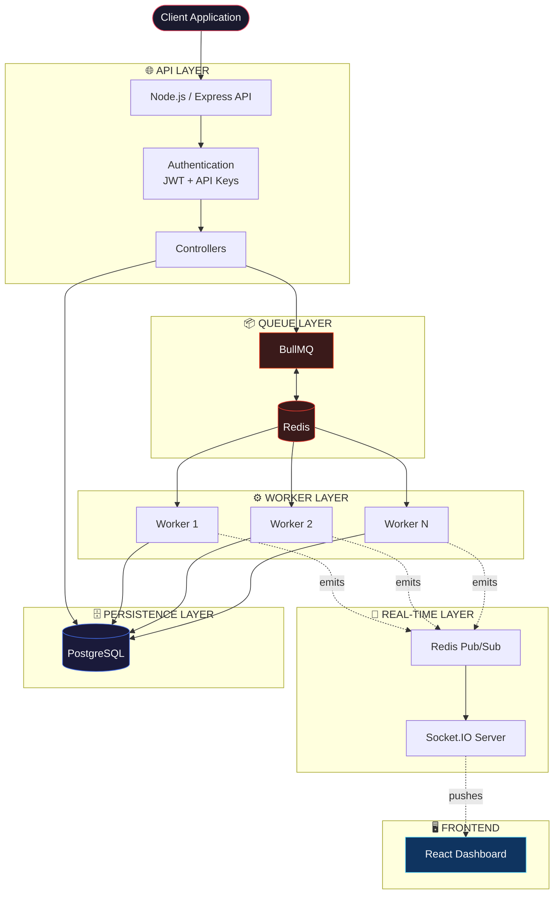
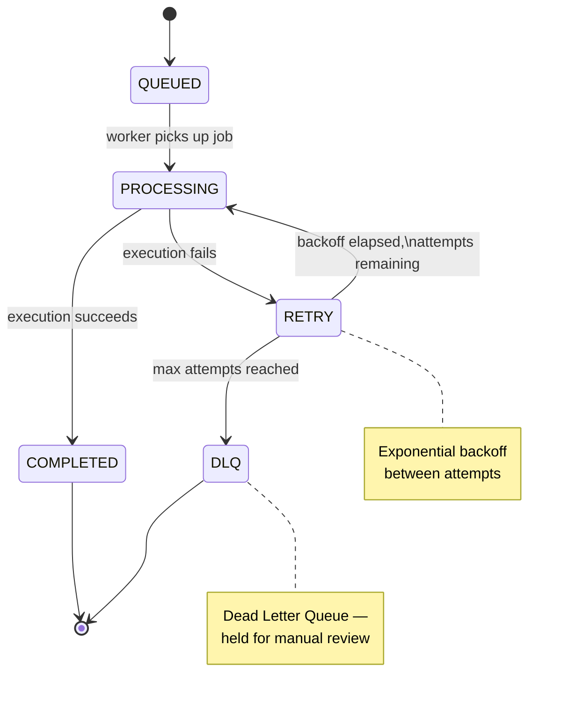

<<<<<<< HEAD
<div align="center">

# ⚡ Aetheris

### Distributed Job Scheduler for Reliable Background Work

*"Run work without losing control."*

[](https://nodejs.org/)
[](https://expressjs.com/)
[](https://docs.bullmq.io/)
[](https://redis.io/)
[](https://www.postgresql.org/)
[](https://react.dev/)
[](https://socket.io/)
[](https://www.docker.com/)

</div>

---

## What is Aetheris?

Aetheris is a backend-focused **distributed job scheduler**. Applications submit work to it instead of running that work inline — Aetheris queues the job, schedules it, retries it if it fails, and reports back what happened.

It's not a UI product with a scheduler bolted on. It's a **control plane for background work**: a small API surface for submitting jobs, a queue layer for coordinating execution, a fleet of workers that actually run the code, and a dashboard that watches all of it happen in real time.

```
Client / Application
        │
        ▼
Node.js + Express API
        │
        ▼
      BullMQ
        │
        ▼
      Redis
        │
        ▼
 Worker Processes
        │
        ▼
  Job Execution
        │
        ▼
   PostgreSQL
```

## Why Aetheris?

Most applications eventually hit the same wall: something needs to run in the background — sending emails, generating reports, processing uploads, syncing external APIs — and doing it inline blocks the request and has no story for failure.

The usual next step is "throw it on a queue library," which handles execution but rarely answers the operational questions that come after:

| Question | Aetheris' Answer |
|---|---|
| What happens when a job fails halfway through? | Automatic retries with exponential backoff, then a Dead Letter Queue |
| How do I know what actually happened to a job? | Full attempt history persisted in PostgreSQL, not just in-memory state |
| Can two network retries create the same job twice? | Idempotency keys enforced at the database layer |
| How do multiple teams/apps share one scheduler safely? | Project-scoped API keys — each project only sees its own jobs |
| Can I *see* the system working, not just query it? | A live React dashboard fed by Redis Pub/Sub over Socket.IO |
| Do I need to poll for job status? | No — status changes push to the dashboard the moment they happen |

Aetheris isn't trying to reinvent job queues from scratch — it's built on the well-tested primitives (BullMQ, Redis) and focuses its own engineering on the parts those primitives don't solve: persistence, multi-tenancy, idempotency, and observability.

## Architecture

Aetheris is deliberately layered. Each layer has exactly one job, which keeps failure modes local instead of cascading.



**Why the separation matters:** the API never executes a job directly. It only ever writes an instruction ("run this") into the queue. This means a slow or crashing job can never take the API down with it — workers can be scaled, restarted, or killed independently of everything else.

## Job Lifecycle

Every job moves through a well-defined state machine. Nothing disappears silently — a job either completes, or it eventually lands in the Dead Letter Queue where it can be inspected and retried manually.



## Features

Aetheris currently supports:

**Scheduling**
- Immediate, delayed, and recurring jobs
- Job priorities
- Queue pause / resume
- Job cancellation

**Reliability**
- Automatic retries with exponential backoff
- Dead Letter Queue for exhausted jobs
- Manual retry of failed jobs
- Full job attempt history

**Execution**
- Multiple worker processes
- Configurable worker concurrency
- PostgreSQL-backed job persistence and status tracking

**Multi-tenancy & Access**
- JWT authentication for dashboard/API users
- User registration and login
- Project-based organization
- Project-specific API keys for external job submission
- Idempotent job creation via `(project_id, idempotency_key)`

**Observability**
- Redis Pub/Sub event stream
- Real-time updates over Socket.IO
- React monitoring dashboard with live job statistics

**Infrastructure**
- Dockerized Redis
- Dockerized PostgreSQL

## How It Works

1. A client authenticates and submits a job — either through the authenticated dashboard API or the external API using a project API key.
2. The API validates the request, checks idempotency, and enqueues the job into BullMQ, then persists a record in PostgreSQL.
3. An available worker picks the job up from Redis and executes it.
4. On success, the job is marked complete. On failure, it's requeued with a backoff delay and retried, up to a configured attempt limit.
5. Jobs that exhaust their retries move to the Dead Letter Queue instead of vanishing.
6. Every state transition is published over Redis Pub/Sub, relayed through Socket.IO, and rendered live on the dashboard — no polling required.

## Core Engineering Concepts

### 1. Distributed Workers

The API's only responsibility is accepting and validating work — it never runs a job's actual logic. Execution is handed off entirely to independent worker processes:

```
Client → API → Queue → Redis → Worker
```

Because workers just consume from Redis, you can run one worker or twenty without changing a line of API code. Aetheris' current worker uses BullMQ's built-in concurrency to process multiple jobs per process.

### 2. Redis vs. BullMQ — Different Jobs, Same Layer

It's easy to conflate these two, but they solve different problems:

| | Redis | BullMQ |
|---|---|---|
| Role | In-memory data store | Job queue abstraction *on top of* Redis |
| Provides | Queue state storage, coordination, Pub/Sub | Scheduling, delayed/recurring jobs, priorities |
| Also handles | — | Retries, backoff, worker processing model |

Redis is the infrastructure; BullMQ is the logic that gives that infrastructure meaning as a job queue.

### 3. PostgreSQL — The System of Record

Redis is fast but transient by design — it's optimized for queue coordination, not long-term history. PostgreSQL is where Aetheris keeps the durable, queryable record of everything that happened:

| Table | Purpose |
|---|---|
| `users` | Dashboard/API account records |
| `projects` | Tenant boundary — jobs belong to a project |
| `jobs` | Job metadata, current status, payload |
| `job_attempts` | One row per execution attempt, for full history |
| `recurring_schedules` | Definitions for repeating jobs |

The split is deliberate: **Redis answers "what needs to happen right now,"** while **PostgreSQL answers "what has happened, ever."** Losing Redis state after a restart is recoverable; losing PostgreSQL history is not — so they're held to different durability standards on purpose.

### 4. Retry + Exponential Backoff

Failures are expected, not exceptional. Aetheris retries a failing job up to **3 attempts**, waiting progressively longer between each:

```
Attempt 1
   │
   ▼ failure
  wait (short)
   │
   ▼
Attempt 2
   │
   ▼ failure
  wait (longer)
   │
   ▼
Attempt 3
   │
   ▼
success ──► COMPLETED
   │
   ▼ failure
Dead Letter Queue
```

Exponential backoff exists to avoid hammering a downstream dependency that's already struggling — a transient database blip or a rate-limited third-party API is far more likely to succeed on a delayed retry than an immediate one.

### 5. Dead Letter Queue (DLQ)

A job that fails through all of its retry attempts doesn't just disappear — it's moved into a separate Dead Letter Queue. This keeps permanently-broken jobs from clogging the active queue while preserving them for inspection: an operator can look at *why* a job failed and choose to retry it manually once the underlying issue is fixed, rather than losing that work entirely.

### 6. Idempotency

External job submissions require two headers:

```
X-API-Key: <project-api-key>
Idempotency-Key: <unique-request-key>
```

Aetheris enforces a unique database constraint on **`(project_id, idempotency_key)`**. If the same idempotency key is submitted twice for the same project, Aetheris returns the *existing* job instead of creating a duplicate.

This matters because networks are unreliable — a client might time out waiting for a response and retry a request that actually succeeded server-side. Without idempotency, that retry creates a duplicate job (and duplicate side effects, like a second email or a second charge). With it, retries are safe by default.

### 7. Redis Pub/Sub vs. BullMQ — Not the Same Thing

These two use the same Redis instance but answer completely different questions:

| | Question it answers |
|---|---|
| **BullMQ / Redis (queue)** | "What work needs to be done?" |
| **Redis Pub/Sub** | "What just happened?" |

The queue is about coordinating *future* execution. Pub/Sub is a fire-and-forget broadcast of *past* events, used purely for observability:

```
Worker → Redis Pub/Sub → Socket.IO → React Dashboard
```

When a worker finishes (or fails) a job, it publishes an event. Socket.IO relays that event to connected dashboard clients instantly — the dashboard never has to ask "did anything change?"; it's told the moment something does.

### 8. Authentication

Aetheris separates two distinct trust boundaries:

- **JWT authentication** — used by human users logging into the dashboard/API to manage their own projects and jobs.
- **Project-specific API keys** — used by external applications submitting jobs programmatically, scoped to a single project.

Users can only ever see and act on projects and jobs they own — there's no cross-tenant visibility.

## Tech Stack

**Backend**
Node.js · Express.js · JavaScript · BullMQ · Redis · Redis Pub/Sub · PostgreSQL · JWT · bcrypt · Socket.IO

**Frontend**
React · Vite · Socket.IO Client · Custom CSS

**Infrastructure**
Docker · Redis (Docker) · PostgreSQL (Docker)

**Development**
Git · GitHub · Postman · VS Code

## Project Structure

```
aetheris/
│
├── dashboard/                # React monitoring dashboard
│   ├── src/
│   │   ├── components/       # Reusable UI building blocks
│   │   ├── context/          # App-wide React context (auth, sockets)
│   │   ├── hooks/            # Custom hooks (job data, live updates)
│   │   ├── pages/            # Route-level views
│   │   ├── services/         # API + Socket.IO client wrappers
│   │   ├── styles/           # Custom CSS
│   │   └── utils/            # Shared frontend helpers
│   ├── package.json
│   └── vite.config.js
│
├── server/                   # Express API
│   ├── config/                # DB, Redis, and app configuration
│   ├── controllers/           # Request handling / business logic
│   ├── database/              # Schema + query layer
│   ├── middleware/            # Auth, validation, error handling
│   ├── queues/                # BullMQ queue definitions
│   ├── routes/                # Express route definitions
│   └── server.js
│
├── worker/                   # Job execution process
│   └── worker.js
│
├── .env.example
├── .gitignore
├── package.json
└── package-lock.json
```

## Getting Started

### Clone the repository

```bash
git clone https://github.com/Ayushl22/Aetheris.git
cd Aetheris
```

### Install dependencies

```bash
# Backend
npm install

# Frontend
cd dashboard
npm install
cd ..
```

### Environment Variables

Copy `.env.example` to `.env` and fill in the values:

```env
REDIS_HOST=localhost
REDIS_PORT=6379

POSTGRES_HOST=localhost
POSTGRES_PORT=5433
POSTGRES_USER=aetheris
POSTGRES_PASSWORD=your_password
POSTGRES_DB=aetheris

JWT_SECRET=your_jwt_secret
```

> ⚠️ **Never commit your `.env` file.** It contains secrets used to sign tokens and connect to your database — keep it local and out of version control.

### Infrastructure (Docker)

```bash
# Redis
docker run -d --name aetheris-redis -p 6379:6379 redis

# PostgreSQL
docker run -d --name aetheris-postgres \
  -e POSTGRES_USER=aetheris \
  -e POSTGRES_PASSWORD=aetheris \
  -e POSTGRES_DB=aetheris \
  -p 5433:5432 postgres
```

Then load the schema:

```bash
# server/database/schema.sql
```

### Run the system

Aetheris runs as three separate processes:

```bash
# Terminal 1 — API
cd server
node server.js

# Terminal 2 — Worker
cd worker
node worker.js

# Terminal 3 — Dashboard
cd dashboard
npm run dev
```

| Service | URL |
|---|---|
| API | http://localhost:3000 |
| Dashboard | http://localhost:5173 |

## API Overview

**Authentication**
```
POST /auth/register
POST /auth/login
```

**Projects**
```
GET    /projects
GET    /projects/:id
POST   /projects
DELETE /projects/:id
```

**Jobs**
```
POST   /jobs
GET    /jobs
GET    /jobs/:id
DELETE /jobs/:id

POST   /jobs/delayed
POST   /jobs/recurring

GET    /jobs/failed
POST   /jobs/failed/:id/retry

POST   /jobs/pause
POST   /jobs/resume
```

**External API** (for job submission from other applications)
```
POST /api/v1/jobs
```

Required headers:
```
X-API-Key: <project-api-key>
Idempotency-Key: <unique-request-key>
```

### Example Request

```bash
curl -X POST http://localhost:3000/api/v1/jobs \
  -H "Content-Type: application/json" \
  -H "X-API-Key: proj_live_9f2a1c7e8b3d4f56" \
  -H "Idempotency-Key: send-welcome-email-user-1042" \
  -d '{
    "type": "send-email",
    "payload": {
      "to": "user@example.com",
      "template": "welcome"
    },
    "priority": 5
  }'
```

## Dashboard

The React dashboard is Aetheris' window into the running system — no log-tailing required.

- Real-time job status, pushed instantly via Socket.IO
- Job statistics at a glance
- Per-job details and full attempt history
- One-click retry for failed jobs
- Job cancellation
- Recurring job management
- Project management
- Queue pause / resume controls


## Reliability

Aetheris treats failure as a first-class case rather than an edge case:

- Failed jobs are retried automatically with exponential backoff before being given up on
- Jobs that exhaust retries are preserved in a Dead Letter Queue instead of being lost
- Every attempt — successful or not — is recorded in PostgreSQL for later inspection
- Idempotency keys prevent duplicate execution caused by network retries
- API and worker processes are decoupled, so a failing job can't take the API down

## Current Status

**Completed**

- [x] Job queue
- [x] Worker processes
- [x] Worker concurrency
- [x] Job priorities
- [x] Delayed jobs
- [x] Recurring jobs
- [x] Retries
- [x] Exponential backoff
- [x] Dead Letter Queue
- [x] PostgreSQL persistence
- [x] Job attempt history
- [x] JWT authentication
- [x] Project management
- [x] Project-specific API keys
- [x] Idempotent job creation
- [x] Redis Pub/Sub
- [x] Socket.IO real-time updates
- [x] React dashboard
- [x] Queue pause/resume
- [x] Job cancellation
- [x] Failed job retry
- [x] Dockerized Redis
- [x] Dockerized PostgreSQL

**Future Add-Ons**

- [ ] Production-grade retry lifecycle
- [ ] Graceful worker shutdown
- [ ] Job timeouts
- [ ] Rate limiting
- [ ] Scheduler management UI
- [ ] Metrics / observability
- [ ] Health checks
- [ ] Full Docker Compose setup
- [ ] Production deployment

## Engineering Takeaways

Building Aetheris meant working through the problems that only show up once a queue is expected to run *reliably*, not just run:

- Separating "what needs to happen" (Redis/BullMQ) from "what has happened" (PostgreSQL) instead of trying to make one store do both jobs.
- Treating retries and the Dead Letter Queue as core functionality, not an afterthought bolted onto a happy-path queue.
- Making idempotency a database constraint rather than a convention — enforced, not just documented.
- Keeping the API and worker processes fully decoupled so scaling or restarting one never risks the other.
- Using Pub/Sub purely for observability, deliberately kept separate from the queue's execution logic, so a dashboard refresh can never affect job processing.

## Author

**Ayush Lambat**

Backend Engineering · Distributed Systems · Job Queues · Redis · BullMQ · PostgreSQL · Real-Time Systems

[GitHub](https://github.com/Ayushl22) · [LinkedIn](https://www.linkedin.com/in/ayush-lambat-926240324)

---

<div align="center">

*Aetheris — run work without losing control.*

</div>
=======
# Aetheris

Aetheris is a multi-tenant background-job scheduler built with React, Express, PostgreSQL, Redis, BullMQ, and Socket.IO. Users can create projects, submit immediate or delayed jobs, manage recurring schedules, inspect execution attempts, and retry terminal failures from a tenant-scoped dead-letter queue.

PostgreSQL is the system of record, BullMQ handles delivery and scheduling, and a separate worker executes registered handlers.

## Architecture

```text
React dashboard ── JWT ──> Express API ─────────────> PostgreSQL
       │                       │                         system of record
       │                       ├── transactional outbox dispatcher
       │                       │             │
       │                       │             v
       │                       └──────────> Redis / BullMQ <── Worker
       │                                              │          │
       └──── authenticated Socket.IO <── Redis Pub/Sub ┘          └── handlers
```

- **Dashboard:** React 19 and Vite. The dashboard provides metrics, seven-day activity, searchable job history, schedule and DLQ operations, project and API-key management, and infrastructure health. It applies live job events and polls while jobs are active as a missed-event fallback.
- **API:** Express 5 with JWT authentication, hashed project API keys, validation, rate limiting, tenant authorization, security headers, restricted origins, and centralized error handling.
- **PostgreSQL:** owns users, projects, jobs, attempts, recurring schedules, DLQ records, idempotency keys, and queue-dispatch state.
- **Redis/BullMQ:** provides priority queues, delays, retry backoff, recurring schedulers, and bounded job retention. Redis uses AOF and `noeviction` in Compose.
- **Worker:** resolves each BullMQ job to a PostgreSQL record, records each attempt transactionally, dispatches by job type, and publishes lifecycle events.
- **Socket.IO:** verifies the same signed JWT as the API. Each connection joins only `user:<userId>`; the API relays Redis Pub/Sub events to that room.

## Reliability model

PostgreSQL and Redis do not share an ACID transaction. New jobs and schedules are committed to PostgreSQL first with a deterministic queue identifier and `PENDING` dispatch state. The API attempts immediate delivery, while an in-process outbox dispatcher retries failed delivery. BullMQ's custom job ID makes a replay idempotent if the process crashes after Redis accepts a job but before PostgreSQL records that fact.

An accepted request can therefore return:

- `201` when the initial Redis dispatch succeeded; or
- `202` when PostgreSQL accepted the work and delivery will be retried.

External requests require an `Idempotency-Key`. A unique `(project_id, idempotency_key)` database constraint ensures concurrent duplicates resolve to the same job.

The job lifecycle is `PENDING → QUEUED` (or `DELAYED`) `→ PROCESSING → COMPLETED`. A failed non-final attempt becomes `RETRYING`; only the final BullMQ attempt becomes `FAILED` and creates one open PostgreSQL DLQ entry. Every attempt is retained in `job_attempts`. A manual DLQ retry archives the open entry, gives the persisted job a new BullMQ ID, and sends it through the outbox again without erasing its attempt history.

Completed BullMQ records are retained for one day or 1,000 records by default. Failed records are retained for seven days or 5,000 records. PostgreSQL job, attempt, and DLQ history is not removed by these BullMQ limits.

## Supported handlers

The worker uses a static registry in `worker/handlers/index.js`. Each entry contains a safe type identifier, display metadata, field hints, an example payload, and the handler function. `GET /jobs/types` exposes only the display metadata to authenticated dashboard clients; it never exposes executable code. Adding a handler requires a code change and deployment. Aetheris does not evaluate payloads, dynamically import user paths, or execute user-provided JavaScript.

| Type | Behavior |
| --- | --- |
| `notification.log` | Validates a message and returns delivery metadata. It does not contact an external notification provider. |
| `http.request` | Performs a bounded HTTP/HTTPS request and returns a response preview. Private/link-local targets and redirects are blocked. |
| `webhook` | Alias of `http.request`. |
| `demo.success` | Deterministic success handler for demonstrations and tests. |
| `demo.flaky` | Fails through `failUntilAttempt`, then succeeds; useful for retry demonstrations. |
| `demo.fail` | Always fails; useful for final-failure and DLQ demonstrations. |

The API intentionally persists any syntactically valid job type, so producers can submit work before a worker rollout reaches every process. A worker that receives an unregistered type fails it through the normal retry lifecycle with `No handler registered for job type: <type>`; after the final attempt it appears in the DLQ. The dashboard composer is stricter and lists only currently registered types from `/jobs/types`.

In production, HTTP handlers are disabled unless `HTTP_JOB_ALLOWED_HOSTS` contains a comma-separated hostname allowlist. DNS results are also checked for private and link-local addresses. Do not use HTTP jobs as a substitute for a general-purpose trusted network client.

## Database and migrations

`server/database/schema.sql` is the canonical schema for a new installation. Runtime migrations live in `server/database/migrations` and are recorded in `schema_migrations`:

1. `001_initial.sql` adopts or creates the original schema.
2. `002_reliability_and_tenancy.sql` adds project ownership, idempotency, lifecycle constraints, outbox state, attempt uniqueness, stable schedules, hashed API-key fields, and the persistent DLQ.

Run migrations before starting a worker:

```bash
npm run db:migrate
```

The API also runs pending migrations at startup. Migration 002 deliberately stops if a legacy installation has jobs with no `project_id`; the old schema did not contain enough information to infer ownership safely. Back up the database, explicitly assign each legacy row to the correct project, and rerun the migration. It does not delete those rows or invent an owner.

## Configuration

Copy `.env.example` to `.env` and replace every placeholder secret. The backend reads the root `.env`; the dashboard reads `dashboard/.env`.

Important backend variables:

| Variable | Purpose |
| --- | --- |
| `PORT` | API port, default `3000`. |
| `DATABASE_URL` | PostgreSQL connection URI. If omitted, the `POSTGRES_*` variables are used. |
| `REDIS_URL` | Redis URI, including `rediss://` where TLS is required. |
| `JWT_SECRET` | JWT HMAC secret; at least 32 characters outside tests. |
| `API_KEY_PEPPER` | HMAC secret used to hash project API keys at rest; at least 32 characters. |
| `ADMIN_API_KEY` | Optional system key required by global queue pause/resume endpoints. If omitted, those endpoints are disabled. |
| `CORS_ALLOWED_ORIGINS` | Comma-separated dashboard origins; required in production. |
| `SOCKET_ALLOWED_ORIGINS` | Comma-separated Socket.IO origins; required in production. |
| `WORKER_CONCURRENCY` | Concurrent worker processors, default `3`. |
| `OUTBOX_POLL_INTERVAL_MS` | Pending-dispatch scan interval, default `2000`. |
| `JOB_RETENTION_*` | BullMQ age/count limits for completed and failed records. |
| `HTTP_JOB_TIMEOUT_MS` | HTTP handler timeout, default 10 seconds. |
| `HTTP_JOB_ALLOWED_HOSTS` | Production hostname allowlist for `http.request` and `webhook`. |

Dashboard variables:

```dotenv
VITE_API_URL=http://localhost:3000
VITE_SOCKET_URL=http://localhost:3000
```

Changing `API_KEY_PEPPER` invalidates existing hashed API keys. JWT and API-key secrets must not be committed or logged.

## Local development

Requirements are Node.js 24, PostgreSQL, and Redis. The example backend configuration expects PostgreSQL on host port `5433` and Redis on `6379`.

```bash
npm ci
npm ci --prefix dashboard
npm run db:migrate
npm start
```

In separate terminals:

```bash
npm run worker
npm run dev --prefix dashboard
```

Open `http://localhost:5173`. `GET /health` confirms that the API process is alive. `GET /ready` returns `200` only when PostgreSQL and BullMQ's Redis connection respond.

## Docker Compose

The shared backend image runs either the API or worker, while the dashboard is built into an Nginx image. Compose also creates persistent PostgreSQL and Redis volumes.

Set at least these values in an uncommitted root `.env`:

```dotenv
POSTGRES_PASSWORD=replace-with-a-strong-password
JWT_SECRET=replace-with-at-least-32-random-characters
API_KEY_PEPPER=replace-with-an-independent-32-character-secret
CORS_ALLOWED_ORIGINS=http://localhost:5173
SOCKET_ALLOWED_ORIGINS=http://localhost:5173
```

Then run:

```bash
docker compose up --build
```

The dashboard is published on `5173`, the API on `3000`, PostgreSQL on host port `5433`, and Redis on `6379`. Containers communicate with the service names `postgres` and `redis`, not `localhost`. For public deployment, use HTTPS origins, build the dashboard with public `VITE_*` URLs, use TLS-capable managed dependencies or a private network, and terminate TLS at a reverse proxy/load balancer.

## API

### Authentication and projects

```bash
curl -X POST http://localhost:3000/auth/register \
  -H "Content-Type: application/json" \
  -d '{"name":"Ada","email":"ada@example.com","password":"a-long-demo-password"}'

curl -X POST http://localhost:3000/auth/login \
  -H "Content-Type: application/json" \
  -d '{"email":"ada@example.com","password":"a-long-demo-password"}'

curl -X POST http://localhost:3000/projects \
  -H "Authorization: Bearer <jwt>" \
  -H "Content-Type: application/json" \
  -d '{"name":"Demo project"}'
```

The project creation response is the only response containing the complete API key. Subsequent project responses expose only its prefix and last four characters. Store the key securely when it is created.

### Immediate and delayed jobs

The request field is `data`, not `payload`.

```bash
curl -X POST http://localhost:3000/jobs \
  -H "Authorization: Bearer <jwt>" \
  -H "Content-Type: application/json" \
  -d '{"projectId":1,"type":"notification.log","data":{"message":"hello"},"priority":"HIGH"}'

curl -X POST http://localhost:3000/jobs/delayed \
  -H "Authorization: Bearer <jwt>" \
  -H "Content-Type: application/json" \
  -d '{"projectId":1,"type":"notification.log","data":{"message":"later"},"priority":"LOW","delay":5000}'
```

`delay` and schedule intervals are milliseconds. Priorities are `HIGH`, `MEDIUM`, or `LOW` (numeric values `1`, `5`, and `10` are also accepted). Useful authenticated endpoints are:

| Method and path | Purpose |
| --- | --- |
| `GET /jobs?projectId=1&limit=100&offset=0` | List the authenticated user's jobs, optionally by owned project. |
| `GET /jobs/types` | List safe metadata for the worker's statically registered job types. |
| `GET /jobs/:databaseJobId` | Read one owned job and all attempts. |
| `DELETE /jobs/:bullmqJobId` | Cancel owned queued/delayed work; active and terminal jobs cannot be cancelled. |
| `GET /jobs/failed` | List the user's open, tenant-filtered DLQ records. |
| `POST /jobs/failed/:dlqId/retry` | Retry an owned DLQ record by its stable `dlq_id`. |

### Recurring schedules

```bash
curl -X POST http://localhost:3000/jobs/recurring \
  -H "Authorization: Bearer <jwt>" \
  -H "Content-Type: application/json" \
  -d '{"projectId":1,"type":"notification.log","data":{"message":"tick"},"every":60000,"priority":"MEDIUM","maxAttempts":3}'

curl -X PATCH http://localhost:3000/jobs/recurring/<scheduleId> \
  -H "Authorization: Bearer <jwt>" \
  -H "Content-Type: application/json" \
  -d '{"every":120000}'
```

Use `GET /jobs/recurring?projectId=1` to list schedules and `DELETE /jobs/recurring/:scheduleId` to delete one. Each schedule has an independent UUID, so a project can have multiple schedules of the same type. Project deletion refuses active work, removes its Redis schedulers and cancellable queued jobs, then uses PostgreSQL cascades for its persisted state.

### External project API

Automation clients authenticate with the one-time project API key and must send an idempotency key:

```bash
curl -X POST http://localhost:3000/api/v1/jobs \
  -H "X-API-Key: aetheris_<project-key>" \
  -H "Idempotency-Key: invoice-2026-00042" \
  -H "Content-Type: application/json" \
  -d '{"type":"webhook","data":{"url":"https://hooks.example.com/aetheris","method":"POST","body":{"invoiceId":42}},"priority":"HIGH"}'
```

Repeating the request with the same project and idempotency key returns the original job instead of creating a duplicate.

Global `POST /jobs/pause` and `POST /jobs/resume` operations affect the entire BullMQ queue. They require both a user JWT and the configured `X-Admin-Key`; they are intentionally absent from the normal dashboard.

## Testing and quality checks

```bash
npm run check
npm run test:unit
npm test
npm run build --prefix dashboard
docker compose config --no-interpolate
```

`npm test` always runs the unit suite. The integration suite is opt-in because it creates and deletes test-owned data and needs isolated PostgreSQL, Redis, API, and worker processes:

```bash
RUN_INTEGRATION_TESTS=1 npm test
```

On Windows PowerShell, set the variable for the current terminal first:

```powershell
$env:RUN_INTEGRATION_TESTS = "1"
npm test
```

The integration flow covers registration/login, duplicates and invalid credentials, project isolation, hashed API keys, external idempotency, handler metadata, registered and unregistered job types, priorities, immediate/delayed/completed/cancelled jobs, automatic retry recovery, terminal failure and tenant-safe DLQ retry, multiple schedule lifecycle operations, project cleanup, invalid input, unauthorized access, admin-only global controls, and auth rate limiting. GitHub Actions provisions isolated PostgreSQL and Redis services, starts the API and worker, runs this suite, and builds the dashboard.

An opt-in Docker resilience check verifies the transactional-outbox behavior during a real Redis outage. It uses only the `aetheris-integration` Compose project and test ports from `test/integration.compose.env.example`:

```bash
docker compose --project-name aetheris-integration --env-file test/integration.compose.env.example up --build --detach
npm run test:resilience
docker compose --project-name aetheris-integration --env-file test/integration.compose.env.example down --volumes
```

## Operational notes

- Run one migration process before scaling API instances. Migrations are transactional and serialized by the schema state, but deployment orchestration should still nominate one migrator.
- The included outbox dispatcher runs in every API process and uses idempotent BullMQ IDs. For higher scale, move dispatch polling to one dedicated process or add row claiming with `FOR UPDATE SKIP LOCKED` to reduce duplicate work.
- The auth rate limiter is process-local. Put a distributed or gateway-level limiter in front of horizontally scaled API replicas.
- Back up PostgreSQL and the Redis AOF volume. PostgreSQL remains authoritative, but Redis persistence reduces queue reconstruction and scheduler disruption.
- Logs are structured JSON and deliberately avoid job payloads, passwords, tokens, and API keys.
>>>>>>> 7878b8e (finalized commits)
